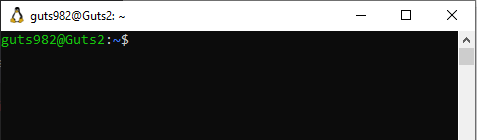
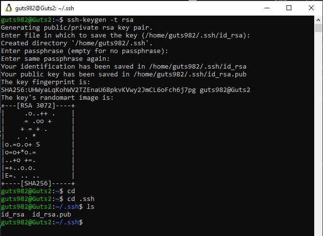
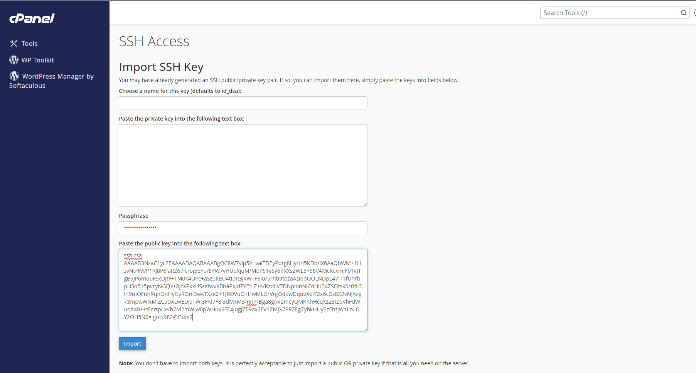
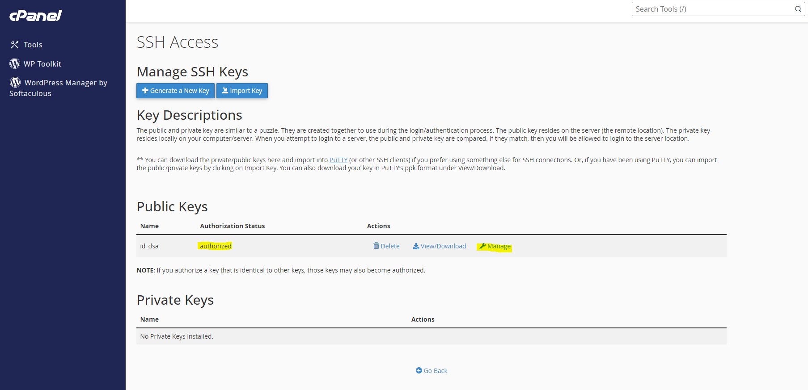
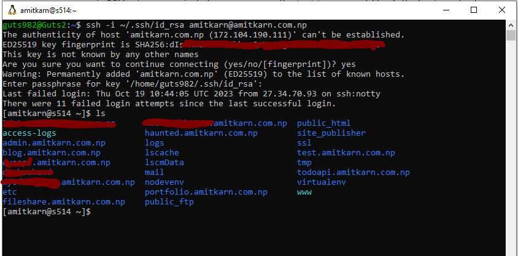

There are two most common ways to connect to cpanel instance via ssh on windows:

* Connect using Putty client.
* Connect via Windows Subsystem for Linux (WSL).

But in this article, we will only focus on connecting via WSL.  So first thing's first if you haven't already,

**Install WSL** :
If you haven't already installed WSL on your Windows machine, you can do so by following Microsoft's official documentation: [Install WSL on Windows](https://docs.microsoft.com/en-us/windows/wsl/install).

**Open WSL Terminal** :
Open your WSL terminal by searching for it in the Windows Start menu or using your preferred terminal emulator (e.g., Windows Terminal).

So that was the prerequisite for windows machine, now lets briefly look into what we're trying to achieve here.

## **SSH ( Secure Shell )**

SSH is a cryptographic network protocol that is used to secure network communication and allow users to access and manage remote systems securely over a potentially unsecured network. SSH encrypts the data exchanged between the client and the server, providing confidentiality and integrity for the communication.

SSH is widely used for tasks like remote shell access, file transfer (SFTP), and tunneling network connections (port forwarding). It has largely replaced older, less secure protocols like Telnet and FTP for remote access and file transfer due to its enhanced security features.

*So basically, it helps us to gain access of some other remote system, from our own.  And that is exactly what we need here, to access our cpanel terminal from our local machine.*

## Public and Private Keys

Public and private keys are fundamental to encrypted communications and play a pivotal role in SSH (Secure Shell). Public keys are openly shared and used for encryption and user authentication, while private keys remain confidential for decryption and digital signature generation. In SSH, users provide their public keys to servers, allowing secure access by decrypting messages sent to their public keys with their private keys. This process enhances security compared to traditional password-based authentication, making it harder for unauthorized parties to gain access to systems.

## STEPS

#### Generate public and private keys.

Go to your search menu, and type and select*Windows Subsystem for Linux*. It will open the default wsl terminal with the ubuntu or any linux os that you installed with wsl.

{/* <!--  --> */}
{/* <!--  --> */}
<CustomImage src="https://raw.githubusercontent.com/guts982/mdx-blogs/master/images/cpanel-ssh-wsl/wsl.PNG" alt="wsl" />

By default the wsl will be inside home directory of linux virtual machine, but you can change that by doing a bunc of cds starting with *"/mnt"* (mount), then *"/d"* (drive) and then some dir , for example *"/mnt/d/somedir"*. Or instead you can directly go to you desired directory from file explorer, open a command line terminal there by right clicking, and execute wsl command inside that directory, it will execute the subsystem with it's mount pointing into you directory.

But for our usecase here, we will store our keys inside the linux subsystem. Because, using a different directory outside of linux subsystem, might cause some permission related issues, as the ssh program requires our keys to have a restricted access, and keeping it on windows directory will literally make it too open for others to see, which is exactly the error you'll get if you try to use keys stored in windows filesystem for a ssh connection. Even using "chmod 600 .ssh/id_rsa" inside mount won't help, because linux and windows both will in a sense keep fighting over the access settings of that directory. If you still will want use the keys stored in the mount, you can try going to the folder's properties and try restricting it's access, uncheck readonly, remove some full control permissions from users, and so on.

Now you can generate the keys in this directory as well, but it will come with complications, so we'll be sticking to the default

Now that we are in our desired directory, we can begin generating the keys ,

<CustomCode>
```bash
ssh-keygen -t rsa
```
</CustomCode>

There will be prompts for file, which we can leave blank and press enter, and a passphrase, which again we can leave blank, but I'll be using a passphrase here.

{/* <!--  --> */}
{/* <!--  --> */}
<CustomImage src="https://raw.githubusercontent.com/guts982/mdx-blogs/master/images/cpanel-ssh-wsl/keygen.PNG" alt="keygen" />

This will generate a  ***.ssh***  directory inside the ***home/`<username>/`*** or  ***home/~/* ** path. The ***.ssh*** will contain two files called  ***id_rsa***  (Private Key) and  *id_rsa.pub*  (Public Key).

#### **Upload public key to the cpanel.**

Now that we have got our public and private keys, we can upload our public key to the cpanel by following these steps.

* Go to you cpanel dashboard.
* Search for and open ***SSH Access***.
* Click on ***Manage SSH Keys*.**
* Click ***Import Key***.
* You can enter a name for the key, or just leave blank if it is the first one.
* Paste the passphrase you while generating key, or leave blank if you didn't.
* Click  ***Import***.

{/* <!--  --> */}
{/* <!--  --> */}
<CustomImage src="https://raw.githubusercontent.com/guts982/mdx-blogs/master/images/cpanel-ssh-wsl/cpanel.PNG" alt="cpanel" />

* Now, finally authorize the imported key going back to SSH Access, and going to ***Manage***  followed by clicking on ***Authorize***.

{/* <!--  --> */}
{/* <!--  --> */}
<CustomImage src="https://raw.githubusercontent.com/guts982/mdx-blogs/master/images/cpanel-ssh-wsl/authorize.PNG" alt="authorize" />

That's all you need to do in cpanel.

#### **Attempt ssh connection.**

Now finally we shall try to start our ssh connection from our local machine's wsl terminal.
Type the following command in your wsl terminal:

<CustomCode>
```bash
ssh -i ~/.ssh/id_rsa USERNAME@DOMAIN_or_IP
``````
</CustomCode>

The username and domain will ofcourse come from you cpanel.

# <!--  -->
# <!--  -->
<CustomImage src="https://raw.githubusercontent.com/guts982/mdx-blogs/master/images/connected-ssh-wsl/connected.PNG" alt="authorize" />


And there it is, you entire subdomains and public_html at your disposal, just a couple of commands away (from second time tho!).  

Okay, that should do it, if you didn't fumble upon wrong passphrase, like I did, so always check and store those kind of entities, in a secure place of your liking. Bye Bye now.
